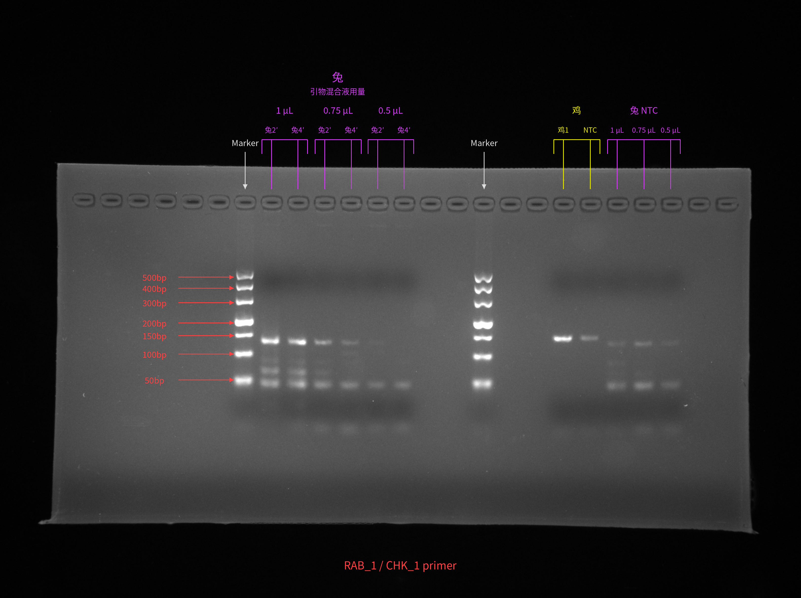
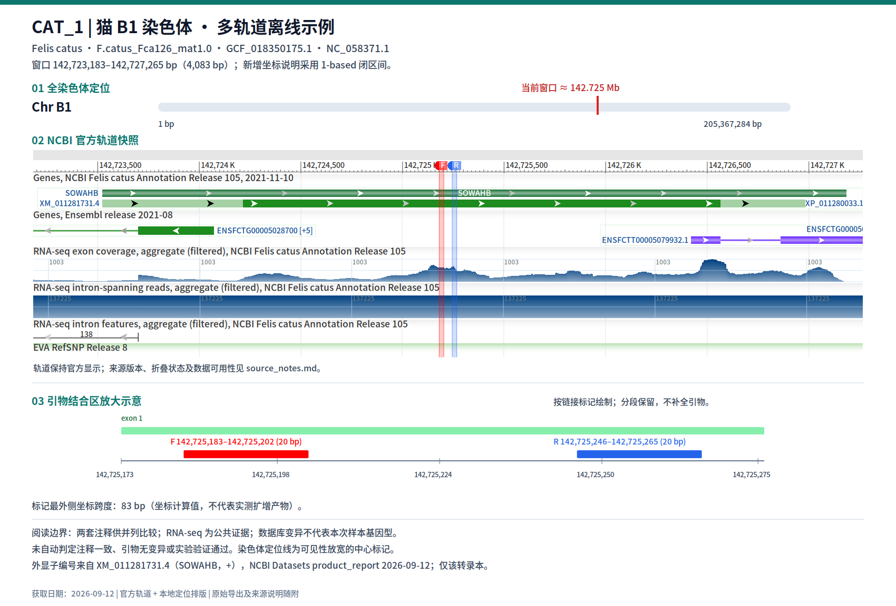

# own-skills

裴崎的 [OpenCode](https://opencode.ai) 自制 skills：给凝胶图标孔、把 BLAST XML 做成离线页、归档 GDV 基因座、核对参考文献、把单篇论文做成原图 PPT。

本仓库是源码，不是运行时加载点。拷进 OpenCode 的 skills 目录后才会被发现。MIT。

## 目录

- [快速入门](#快速入门)
- [可选：不启动 OpenCode 看产物](#可选不启动-opencode-看产物)
- [Skills](#skills)
  - [gel-annotation](#gel-annotation)
  - [blast-offline-html](#blast-offline-html)
  - [gdv-offline-evidence](#gdv-offline-evidence)
  - [nature-ref-verifier](#nature-ref-verifier)
  - [paper2ppt](#paper2ppt)
- [安装位置](#安装位置)
- [边界](#边界)
- [License](#license)

## 快速入门

1. 克隆本仓库，把要用的 skill 拷到 OpenCode 能找到的位置（项目级优先）：

   ```bash
   git clone https://github.com/peiqi335/own-skills.git
   mkdir -p .agents/skills
   cp -a own-skills/paper2ppt .agents/skills/
   ```

2. 重启 OpenCode，或在当前会话重载 skills。
3. 把论文路径换成你的文件，直接说：

   ```text
   启动 paper2ppt 工作流，论文在 ./papers/example.pdf
   ```

其余 skill 同样只需要一句话：

```text
给这张第二批凝胶标孔，泳道从左到右是 Marker、样品1、NTC
把这份 BLAST XML 渲成可断网打开的 HTML
按 CAT_1 标准做这个 GDV 基因座的离线证据图
校验这篇开题报告的参考文献
```

详细规则在各目录的 `SKILL.md`。未指定输出位置时，agent 按该 skill 的约定落盘，而不是写进本仓库。

## 可选：不启动 OpenCode 看产物

脚本可以单独跑。下面用自带夹具生成一页离线 BLAST HTML：

```bash
git clone https://github.com/peiqi335/own-skills.git
cd own-skills
python3 blast-offline-html/scripts/render_blast_offline.py \
  blast-offline-html/tests/fixtures/tiny_blastn.xml \
  -o /tmp/own-skills-blast-demo
```

输出是 `/tmp/own-skills-blast-demo/tiny_blastn.html` 和同目录的 `viewer.css`。浏览器直接打开该 HTML（`file://` 可用），应看到 query 长度 20、黑色 Query 主条、两条命中。这只验证渲染器，不跑 `blastn`。

## Skills

### gel-annotation

给琼脂糖凝胶照片标孔位和泳道身份，另存 PNG。只定位、只标注，不解释条带，不改实验记录页。

**你说什么**

```text
给这张第二批凝胶标孔，泳道从左到右是 Marker、样品1、NTC
```

**得到什么**

原图旁一份新 PNG（引线准确落在孔心、支持分组层级、空孔避让与已核实的 Ladder 标尺，不覆盖原图）：



尚无确认方案时，agent 先给逐孔表和执行方案，等你确认再画。几何来自本轮对这张图的扫描；身份只能来自你的说明或你指定的记录。

**不要指望它**

从图上有没有条带来猜空孔，或把命中写成 PCR 结论。

### blast-offline-html

把已有单 query BLASTN XML（`-outfmt 5`）渲成可拷到 U 盘、断网双击打开的结果页。权威数据是 XML；页面只是展示层。

**你说什么**

```text
把 ./hits.xml 渲成可断网打开的 HTML
```

**得到什么**

一个目录，通常是 XML 旁的 `blast-offline/`（调用 CLI 时必须 `-o`）：

```text
blast-offline/
├── tiny_blastn.html
└── viewer.css
```

页面含 Graphic Summary、Descriptions、pairwise alignments。夹具 `tests/fixtures/tiny_blastn.xml` 的 query 长 20 bp、两条命中；渲染结果无 NCBI 外链。不跑 BLAST，不拉 RID。

**不要指望它**

把 BLAST 命中当成物种鉴定，或从胶图反推坐标。

### gdv-offline-evidence

把 NCBI GDV / Sequence Viewer 的指定基因座做成可断网打开的多轨道 PDF、SVG、PNG，并留下来源与检查记录。

**你说什么**

```text
按 CAT_1 标准做这个 GDV 链接的离线证据图
```

**得到什么**

用户指定结果目录下的一套文件，例如 `{locus_id}_enhanced.png`、官方轨道 SVG、`spec.json`、`source_notes.md`。标准例（猫 B1 / SOWAHB，不是通用装饰图）：



轨道保持 NCBI 官方显示；RNA-seq 是公共证据，变异轨道不是本样本基因型。完整标准在 [`assets/cat1-standard/`](gdv-offline-evidence/assets/cat1-standard/)。

**不要指望它**

从截图猜坐标，或自动判定引物特异性、注释一致、实验验证通过。

### nature-ref-verifier

对参考文献逐条做多源核对：作者顺序、标题、年份、卷期、页码、DOI。可处理整篇、单条或 `.bib`。

**你说什么**

```text
校验这篇开题报告的参考文献
```

**得到什么**

结构化报告，必要时附 BibTeX 补丁。默认只报告差异，不改 Zotero，除非你明确授权写入。

```markdown
## 验证结果：56 条文献

- Verified: 42
- Check suggested: 8
- Needs fix: 4
- Unverifiable: 2

### 必须修正
| # | 问题 | 当前值 | 正确值 | 来源 |
|---|------|--------|--------|------|
| [6] | 作者错误 | Smogavec P | Leckebusch J | Wiley |
```

**不要指望它**

Crossref 404 就断定 DOI 写错（只说明 Crossref 未查得）；也不要把产品手册、专利当期刊条目硬核。

### paper2ppt

单篇精读、讨论逻辑主线，确认后再做原图驱动的可编辑 PPTX。图只来自该论文及补充材料，允许裁切和等比缩放，禁止生成或重绘机制图。

**你说什么**

```text
启动 paper2ppt 工作流，论文在 ./papers/example.pdf
```

**得到什么**

先是精读笔记和讨论，正常停在「待主线确认」。你说「按这个主线制作」之后，才有 PPT。归档示例：

```text
第一作者_年份_简短题名/
├── 00.任务进度.md
├── 01.精读笔记.md
├── 02.讨论与汇报主线.md
├── 03.逐页安排.md
├── 04.原图清单.md
├── 05.验收记录.md
├── 原图/
└── 汇报/
    └── 第一作者_年份_文献汇报_v01.pptx
```

未指定根目录时，agent 会找项目里的 `6.文献汇报/`，找不到再问。「懂了，继续讲」只推进讨论，不等于授权做 PPT。

**不要指望它**

跳过精读直接出幻灯片，或用外部/生成图装饰。

## 安装位置

| 位置 | 作用 |
| --- | --- |
| `<项目>/.agents/skills/<name>/` | 仅该项目；优先用这个 |
| `<项目>/.opencode/skills/<name>/` | 仅该项目（OpenCode 布局） |
| `~/.config/opencode/skills/<name>/` | 当前用户所有项目 |

每个 skill 保持独立目录，不要打散 `SKILL.md`、`scripts/`、`references/`、`assets/`。拷完后重启或重载，否则 agent 仍看不到。

## 边界

- `gel-annotation`、`gdv-offline-evidence`、`blast-offline-html` 面向 PCR / 基因组 vault 的相对目录（如 `1.原始资料/`、`4.知识库/`），不是即插即用的通用工具。
- `paper2ppt` 需要你指定或确认汇报根目录。
- `nature-ref-verifier` 要联网；Zotero、CNKI 有则用、无则降级。
- 胶图、BLAST 命中、GDV 轨道都不是湿实验结论。

## License

[MIT](LICENSE) © 2026 裴崎
